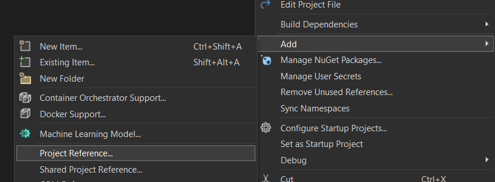

Unit testing in C# with xUnit can at times be unwieldy, especially if, like me, you're accustomed to something flexible and easy like [Jest](https://jestjs.io/). One thing the tutorials often forget to tell you is how to link your test suite project to your primary project. This causes your test suite to be unable to "see" the classes from your main project.

## The Problem in a Nutshell

Here's how the problem arises. You create a solution that contains two projects: `ExampleProject` and `ExampleProject.Tests`. They're in sibling directories, so that the file structure looks like this:

```txt
solution-root
├── solution.sln
├── ExampleProject
│   ├── ExampleProject.csproj
│   ├── Program.cs
│   └── ExampleClass.cs
└── ExampleProject.Tests
    ├── ExampleProject.Tests.csproj
    └── Test.cs
```

However, you get a compiler error when you try to access classes from the `ExampleProject` namespace, e.g. `ExampleProject.ExampleClass`, from the xUnit project. xUnit can't "see" those things, even if you add a big fat `using` statement at the top of `Test.cs`.

(N.B. The projects don't necessarily need to be siblings for this problem to occur. They could be nested, too.)

## The Solution

The solution is to explicitly link the main project to the test project by adding a **project reference**. I will show you three ways to achieve this: in Visual Studio, in the console, and manually.

> Once you've done this, you won't even need a `using` statement in your test suite. xUnit knows where to look.

### In Visual Studio

If you're using Visual Studio (not VS Code), then it's pretty easy to add a project reference to your test project.

All you have to do is right-click your test project directory (i.e. `ExampleProject.Tests`) in the Solution Explorer. In the context menu (shown below), go to **Add > Project Reference...** A popup will open showing you all local repos available to link to. Select `ExampleProject`, press OK and you're done!



### In the console

The command-line way to do it is just as easy as it is in Visual Studio directly. First, navigate to the folder containing your test project (i.e. `ExampleProject.Tests`).

Then enter the following command into your terminal:

```sh
$ dotnet add reference ..\ExampleProject\ExampleProject.csproj
                       ^^^^^^^^^^^^^^^^^^^^^^^^^^^^^^^^^^^^^^^
                       Put the relative path to your main
                       project here.

Output:
Reference `..\ExampleProject\ExampleProject.csproj` added to the project.
```

That's all! You're now good to go.

You can find out more about the `dotnet add reference` command [here](https://learn.microsoft.com/en-us/dotnet/core/tools/dotnet-add-reference).

### Manually

If all else fails, there's the not-so-good way to do it: by hand. Open your test project file (i.e. `ExampleProject.Tests.csproj`). You'll see a bunch of XML inside a `<Project>` tag. All you have to do is add this code inside that main tag, replacing the path as necessary:

```xml
<ItemGroup>
    <ProjectReference Include="..\ExampleProject\ExampleProject.csproj" />
</ItemGroup>
```

This is what the other solutions, above, do for you under the hood. This XML code functions like a highest-level `using` statement.
