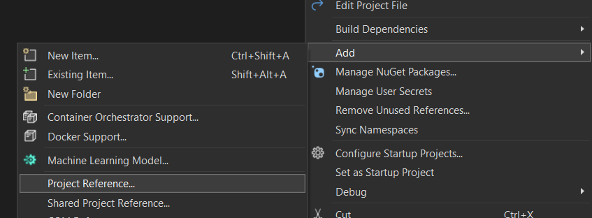

Unit testing in C# with xUnit can at times be unwieldy, especially if, like me, you're accustomed to something like [Jest](https://jestjs.io/). One thing the tutorials often forget to tell you is how to link your test suite project to your primary project.

## The Problem

Here's how the problem arises. You create a solution contains two projects: `ExampleProject` and `ExampleProject.Tests`. They're in sibling directories, so that the structure looks like this:

```txt
solution-root
├── solution.sln
├── ExampleProject
│   ├── ExampleProject.csproj
│   ├── Program.cs
│   └── ExampleClass.cs
└── ExampleProject.Tests
    ├── ExampleProject.Tests.csproj
    └── Test.cs
```

However, you get a compiler error when you try to access classes from the `ExampleProject` namespace, e.g. `ExampleProject.ExampleClass`, from the xUnit project. xUnit can't "see" those things, even if you add a big fat `using` statement at the top of `Test.cs`.

(N.B. The projects don't necessarily need to be siblings for this problem to occur. They could be nested, too.)

## The Solution

The solution is to link the main project to the test project. There are multiple ways to achieve this, but I will show you three ways: in Visual Studio, in the console and manually. I'm sure there's a way to do it in JetBrains, too, though I've never used it before.

### In Visual Studio

If you're using Visual Studio (not VS Code), then it's pretty easy to add a project reference to your test project.

All you have to do is right-click your test repo directory (i.e. `ExampleProject.Tests`) in the Solution Explorer. In the context menu (shown below), go to **Add > Project Reference...** A popup will open showing you all local repos available to link to. Select `ExampleProject`, press OK and you're done!



### In the console

### Manually

If all else fails, there's the not-so-good way to do it: by hand. Open your test project file (i.e. `ExampleProject.Tests.csproj`). You'll see a bunch of XML inside a `<Project>` tag. All you have to do is add this code inside that main tag, replacing the path as necessary:

```xml
  <ItemGroup>
    <ProjectReference Include="..\ExampleProject\ExampleProject.csproj" />
  </ItemGroup>
  ```

This is essentially what the other solutions, above, do for you. This XML code functions like a highest-level `using` statement.

- how to solve
  - solution in VS
  - solution from command line (if there is one)
  - don't forget to add a using statement
- if you figure out, during the writing of this article, why this problem happens in the first place, then write something somewhere about it

artikel ueber warum xunit tests nicht funktionieren

In C#, namespaces are used to organize code and prevent naming conflicts. If you have a console application called XYZ and an xUnit testing project called XYZ.Tests in sibling directories, you'll want to ensure that the namespace XYZ is available in the XYZ.Tests project.

Here are the steps you can follow:

    Check Namespace in Console Application:
        Open the console application (XYZ) in Visual Studio.
        Look at the namespace declared at the top of your C# files. It might look something like this:

        csharp

        using XYZ;

    Verify Namespace Usage:
        Make sure that you are using types from the XYZ namespace in your test files.

By following these steps, you should be able to use the types from the XYZ namespace in your XYZ.Tests project. This assumes that the console application (XYZ) is properly building and the types are accessible.

Here's a simple example:

Console Application (XYZ):

csharp

// XYZ/Program.cs

namespace XYZ
{
public class MyClass
{
public int Add(int a, int b)
{
return a + b;
}
}
}

Test File (XYZ.Tests):

csharp

// XYZ.Tests/MyClassTests.cs

using Xunit;
using XYZ;

public class MyClassTests
{
[Fact]
public void TestAddition()
{
MyClass myClass = new MyClass();
Assert.Equal(5, myClass.Add(2, 3));
}
}

Ensure that you've added the reference, imported the namespace, and that your test files can access the types from the XYZ namespace.

        namespace XYZ
        {
            // Code here
        }

    Reference Console Application from Tests Project:
        Open the xUnit testing project (XYZ.Tests) in Visual Studio.
        Right-click on the project in Solution Explorer and select "Add" > "Reference..."
        In the "Reference Manager" dialog, go to the "Projects" tab and select the XYZ project.

    Import Namespace in Test Files:
        In the test files of the XYZ.Tests project, you'll need to import the namespace XYZ to use its types. You can do this by adding a using directive at the top of your test files:

        csharp
